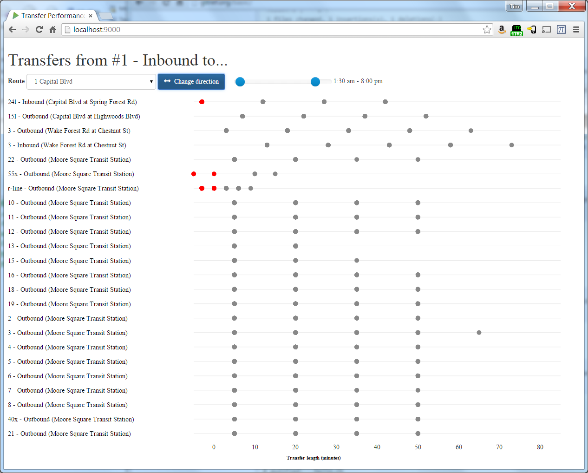

# pulsar: evaluate connection times by route

Connection times can greatly influence the users' perspective of a transit system. In a low-frequency environment, with
vehicles running once every half-hour or hour, the time to connect between two vehicles can dominate the total trip time.
This tool allows one to visualize connection times on a route-by-route basis, to see which connections are performing well
or poorly.

## Installation

Installation should be pretty simple. Create a directory `gtfs` in the root directory of the checkout and copy your GTFS
file into that directory. Call it `baseline.zip`. (This name is hardwired in the code; changing this is planned). Then
type `./activator run -mem 4096`, adjusting the memory allocation as needed, to start the tool. Load `http://localhost:9000`
and select a route and a direction to visualize transfer times. You can filter the transfer times by time of day using
the range slider. Each dot represents a transfer.

## Filtering

The connections are filtered using the following rules:

- When there are multiple contiguous stops where one can connect from Route A to Route B, only the first and last will
  be shown.
- Connections longer than 90 minutes are filtered out as unreasonable, under the assumption that they are not connections
  anyone would make and thus do not affect the users' experience of the system.
- Connections from Route A that occur before Route B is running are filtered (in practice, if 3 vehicles on route A arrive
  before the first vehicle arrives on route B, the first two vehicles on route A are ignored. This only applies at the
  start of the day; if service is split in two pieces (e.g. morning and afternoon rush), this filtering does not apply
  to the second span.) 

## Data Notes

The transit day queried by default is 2015-02-04.  Pulsar queries this date from the GTFS feed via calendar_dates.txt rather 
than the more conventional calendar.txt.  Those familiar with the GTFS data specification may be confused by this as 
calendar_dates.txt is an optional file and calendar.txt is required.  Furthermore, calendar_dates.txt is commonly used by 
an agency to indicate irregular service dates and exceptions, such as running Sunday service on a holiday that falls on a 
weekday.  

The code has been altered to show route direction as either "Outbound" or "Inbound" in index.html.  The issue herein is that 
the GTFS feed for my preferred agency uses the value of '1' Inbound as and '0' as Outbound in the direction_id field in 
trips.txt.  The issue for you as a user of a different feed is that while 0 and 1 as the only values permitted to be used
here, there is no specification that requires 1 be inbound and 0 outbound - you will need to check your feed and adjust 
the code as necessary in pulsar.js  Also, a flaw right now is it does not accurately descirbe looping routes or routes
which are locally referred to by "eastbound vs westbound" etc.  

The code has been modified to display "missed" transfer - i.e. transfers that occurred up to 5 minutes before the origin bus arrived - in red to show "close calls" within the schedule.  While it's of no use for a passenger to know that he or she has just missed a bus it's valuable to service planners to understand where these events are occuring, especially if a trasnfer is missed by just a few minutes and the wait time for the next transfer is large.  

## TO-DO

Confirm that the "just missed transfer" feature works properly and doesn't cause the code to skip the display of the next viable transfer at that stop.  
